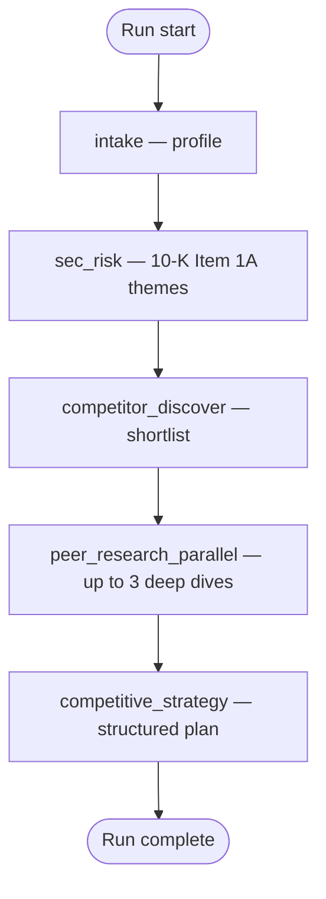

# BattleScope

Autonomous **competitive research and strategy**: you provide a company name or URL, and the system discovers rivals, gathers evidence on the open web, and returns a **structured** teardown plus priorities—meant to be read in a dashboard, not as one long essay.

## Problem and approach

> **In one line:** anchor open-web research in **regulated filings (10-K Item 1A)**, then **discover ≥3 competitors**, **deep-dive** the top peers, and ship a **structured** strategy the dashboard can scan—not one long essay.

### What we had to deliver

| Pillar | What it means here |
|--------|---------------------|
| **Discover** | No competitor list in the prompt—the agent finds who matters. |
| **Research** | Real-time web + structured sources; evidence over vibes. |
| **Analyze** | Compare the **target** vs peers against a **shared** risk lens. |
| **Strategize** | Concrete, **tabbed** outputs (risk, landscape, peers, strategy)—not generic advice. |

### The hard part: grounding

- **Marketing sites** sell certainty; **SEO articles** often repeat the same lines.
- We still **need the web** for *who is in the market* and *what they are doing now*.
- We needed a **second source** that behaves more like **due diligence** than brand copy.

### How we narrowed the question

**Instead of:** “Summarize the internet about Company X.”

**We optimized for:** *Given the strongest **official** articulation of what could hurt the target, how do **named** competitors show up against that same backdrop—and what should leadership do next?*

### The anchor: Item 1A (10-K)

> [!NOTE]
> **Item 1A — Risk Factors** is part of the annual **10-K** filed with the SEC. It is **not** a full “weakness audit,” but it **is** *regulated disclosure*: material risks and uncertainties (competition, regulation, execution, etc.). That gives every later step—competitor discovery, peer research, final strategy—the **same lens** instead of a model-only freestyle on unstructured hype.

**Why it helps**

- Filings are **reviewer-shaped** text, not ad copy.
- Themes become **indexed bullets** downstream agents can cite against.

### Pipeline shape

- **Fixed stages every run** → same order, easy to audit and debug.
- **≥3 competitors** on the happy path, each researched with **tools + caps**.
- **Artifacts** flow into the UI: risk dossier → landscape → deep dives → strategy.

## Agents, tools, memory, and failure handling

Orchestration is a **LangGraph** linear workflow: each stage is a graph node with a clear contract on what it reads from state and what it writes back. That keeps “agentic” behavior where it helps—**bounded ReAct** loops with tools inside intake, competitor discovery, and peer research—while the overall run stays **easy to trace and debug**.



*Intake, competitor discovery, and peer research each run a **bounded ReAct** loop (tool calls + LLM) instead of a single monolithic prompt.*

| Stage | What it does | Tools and mechanics |
|--------|----------------|---------------------|
| **intake** | Normalize URL, build **company_profile** (summary, uncertainties, optional earnings-call hints). | **ReAct** agent with **Tavily** (search), **Firecrawl** (read site), optional **Alpha Vantage** for ticker context; heuristic profile if APIs are unavailable. |
| **sec_risk** | Resolve latest **10-K**, extract **Item 1A**, distill **risk_theme_bullets** into `sec_risk_dossier`. | **Financial Modeling Prep** for filing metadata/links, HTTP fetch of filing HTML, deterministic **Item 1A** windowing + LLM pass for themes. |
| **competitor_discover** | Produce **≥3** competitors and map them to the risk / profile context → `competitor_landscape`. | **ReAct** with **Tavily**, **Firecrawl**, optional **NewsAPI**; structured landscape schema. |
| **peer_research_parallel** | Deep **per-peer** passes (up to **three** peers in parallel). | `asyncio.gather` of **ReAct** sessions—same tool family as discovery—each capped by a **recursion limit**; digest per peer in `peer_research_digests`. |
| **competitive_strategy** | Terminal synthesis: matrix, prioritized moves, peer deep dives, cross-peer levers, etc. | **OpenAI structured output** (Pydantic) over a packed context window; optional **Tavily** follow-up pass when `STRATEGY_TAVILY_FOLLOWUP` is enabled. |

### Memory model

> **In one line:** there is **no durable DB** for the take-home—everything worth keeping for a run lives in LangGraph **`GraphState`**, so the “memory” is **inspectable JSON-shaped fields**, not hidden scratchpad text.

| `GraphState` field | What it holds |
|--------------------|----------------|
| `company_profile` | Normalized intake: name, summary, uncertainties, optional earnings hints. |
| `sec_risk_dossier` | Latest **10-K Item 1A** pass → theme bullets + extraction metadata. |
| `competitor_landscape` | **≥3** (target) competitors, confidence, optional **degraded** flags / reasons. |
| `peer_research_digests` | Per-peer deep research payloads (parallel paths). |
| `competitive_strategy` | Final structured strategy object for the dashboard. |
| `trace_events` | **Append-only** timeline for SSE / “agent is working” UI. |
| `planner_notes` | Short human-readable breadcrumbs alongside the graph. |

**How it behaves**

- Each node **reads** prior fields and **returns patches**; the graph **merges** them forward—same contract every stage.
- That is the whole **run notebook**: no separate chain-of-thought store; transparency is **state + traces**.

> [!TIP]
> **Stateless submission:** no cross-run database is required. A **future** version could add persisted runs, eval sets, or **episodic** memory (“how we unblocked this failure mode last time”); not in scope here.

---

### Rescue plan (when things go wrong)

> **Principle:** **fail visible**, cap cost, and **never** pretend the competitor set or filings are complete when they are not.

| Layer | What we do |
|--------|------------|
| **See it** | Every node logs **`trace_events`**; the UI consumes **SSE** on `GET /runs/{run_id}/events` so users see **which stage** is active and when it completes. |
| **Skip cleanly** | Missing **`OPENAI_API_KEY`** → LLM nodes return **`skipped`** / empty artifacts with a clear reason instead of a blind 500. |
| **Degrade honestly** | **`intake_degraded`** when profile confidence is low; **`competitor_landscape.degraded`** + notes when the shortlist is thin; strategy carries **`input_quality`** and can be **`partial`**—**the dashboard shows that**, not fake confidence. |
| **Stop runaway work** | Filings and web payloads are **clipped** to max chars before the model; ReAct agents use **recursion limits** in `settings.py` so tool loops cannot spin forever. |
| **Ride network blips** | Shared HTTP client applies **retries** on transient failures where configured. |

> [!IMPORTANT]
> **“Degrade, don’t lie”** is the product default: when upstream evidence is incomplete, the UI and payload say so—so reviewers see **judgment**, not hallucinated completeness.

*Still to add: how we used AI coding assistants, and “another day” roadmap.*

## Prerequisites

- Node.js 20+
- Python 3.11+
- Optional: [uv](https://docs.astral.sh/uv/) for faster Python env management

## Web app

```bash
npm install
npm run dev:web
```

Open [http://localhost:3000](http://localhost:3000).

## API (FastAPI + LangGraph scaffold)

```bash
cd apps/api
python -m venv .venv
source .venv/bin/activate
pip install -e ".[dev]"
# or: pip install -r requirements.txt && pip install -e .
pytest
uvicorn battlescope_api.main:app --reload --port 8000
```

The LangGraph `intake` node is **async**; call it with `await graph.ainvoke({...})` (see `tests/test_graph_smoke.py`).

Health check: [http://localhost:8000/health](http://localhost:8000/health).

**Streaming runs (SSE):** `POST /runs/start` returns `202` with `run_id` and `events_url`; `GET /runs/{run_id}/events` streams `text/event-stream` (`data:` JSON with `type` `state` | `complete` | `error`). The web dashboard consumes this path. The in-memory run registry is **single-process / single-worker** only (not for horizontal scale).

Phase 0 harness: JSON line logging (`log_setup`), retrying `ToolClient`, `parse_llm_json`, and `tests/fixtures/`. **IntakeProfiler** (`graph/nodes/intake.py`) calls Tavily + Firecrawl + OpenAI when keys are set, with heuristic fallback when not.

**LangSmith:** add `LANGSMITH_TRACING=true` / `LANGSMITH_TRACING_V2=true` or `LANGCHAIN_TRACING_V2=true`, plus `LANGSMITH_API_KEY` / `LANGCHAIN_API_KEY` and project vars to `apps/api/.env`. On import, `settings.py` runs `load_dotenv(apps/api/.env)` so those variables reach `os.environ` (LangSmith reads the environment directly, not only Pydantic fields). `@traceable` spans live in `tools/tavily_client.py`, `firecrawl_client.py`, and `llm.py`.

Copy `apps/api/.env.example` to `apps/api/.env` and add API keys when you wire Tavily, Firecrawl, and your LLM provider.

## Layout

- `apps/web` — Next.js UI
- `apps/api` — Python package `battlescope_api` (FastAPI entry, LangGraph under `graph/`)
