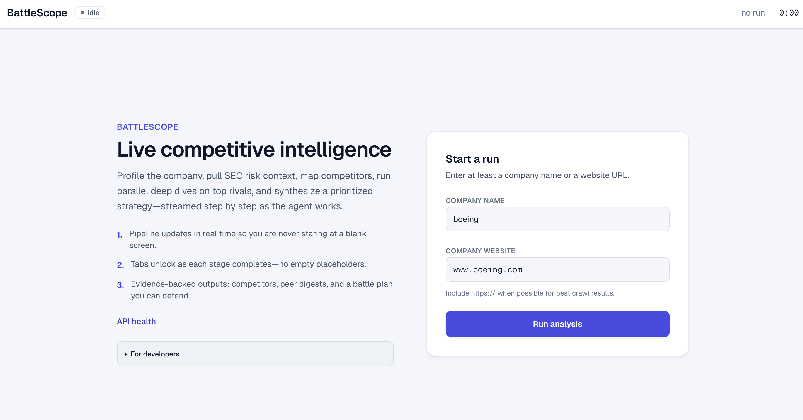
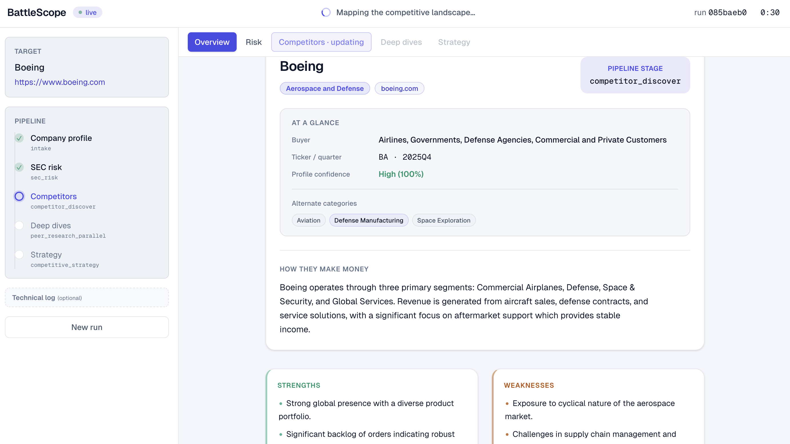
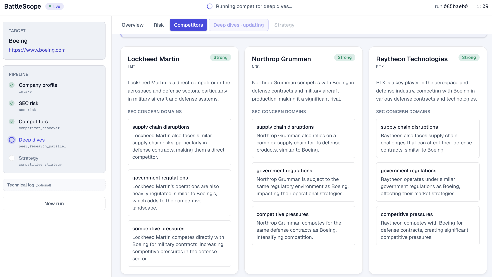
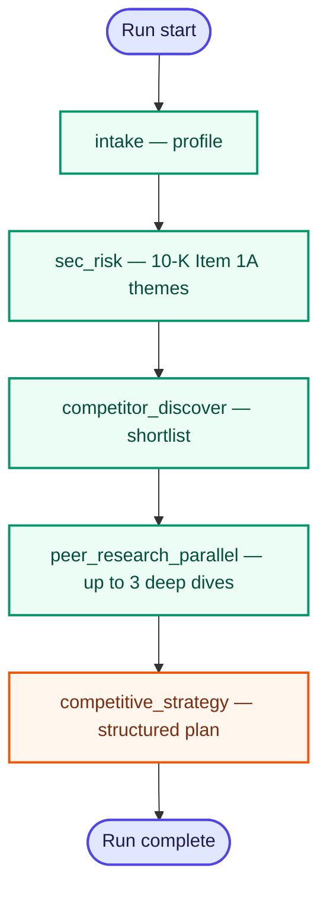

# BattleScope

[](https://www.python.org/)
[](https://nextjs.org/)
[](https://fastapi.tiangolo.com/)
[](https://langchain-ai.github.io/langgraph/)
[](#run-locally)
[](https://competitive-analysis-agent-web.vercel.app/)

Autonomous **competitive research and strategy**: you provide a company name or URL, and the system discovers rivals, gathers evidence on the open web, and returns a **structured** teardown plus priorities—meant to be read in a dashboard, not as one long essay.

### Live demo

- **Web (Vercel):** [https://competitive-analysis-agent-web.vercel.app/](https://competitive-analysis-agent-web.vercel.app/)
- **API (Railway):** [https://battlescopeagent-production.up.railway.app](https://battlescopeagent-production.up.railway.app) — health check: [`/health`](https://battlescopeagent-production.up.railway.app/health), OpenAPI: [`/docs`](https://battlescopeagent-production.up.railway.app/docs)

The hosted UI is configured to call the Railway API (`NEXT_PUBLIC_API_URL`). You can still [run everything locally](#run-locally).

### Screenshots

**Start a run** — name and/or URL, API health, developer hint for `POST /runs/start` + SSE.



**Dashboard** — pipeline updates in real time; tabs unlock as stages complete.



**Competitors** — discovered landscape for the target company.



## What I built (take-home scope)

Here is what I shipped against the brief, in plain terms:

- **Input:** I built a **Next.js** flow where you enter a company **name** and/or **URL** (either is enough).
- **Discover:** I wired autonomous competitor discovery toward **≥3** named rivals (prompt + Pydantic schema). When the evidence stack is thin after dedupe, `competitor_landscape` surfaces **`degraded`** instead of faking a full shortlist.
- **Research:** I used **bounded ReAct** for intake, discovery, and peer passes, backed by **real tools** (search, crawl, optional headlines / transcripts / filing metadata)—not one monolithic “ask the model everything” call.
- **Analyze + strategize:** Where a **10-K Item 1A** path resolves, I anchor peer comparison on that **shared risk lens**, then land a **structured** strategy object the UI splits into **tabs** (risk, landscape, peers, strategy) so you can scan it quickly.
- **Real-time UI:** I stream **`trace_events`** over **`GET /runs/{id}/events`** (**SSE**) so you see **which stage is running** instead of waiting on a silent spinner until the graph finishes.
- **How I’m submitting it:** a **runnable monorepo** ([Run locally](#run-locally)) plus a **hosted demo** ([Live demo](#live-demo) and screenshots above). I can pair this README with a short **Loom** if you want a walkthrough; the write-up is meant to stand alone if you prefer text only.

## Problem and approach

> **In one line:** anchor open-web research in **regulated filings (10-K Item 1A)**, then **discover ≥3 competitors**, **deep-dive** the top peers, and ship a **structured** strategy the dashboard can scan—not one long essay.

### What we had to deliver

| Pillar | What it means here |
|--------|---------------------|
| **Discover** | No competitor list in the prompt—the agent finds who matters. |
| **Research** | Real-time web + structured sources; evidence over vibes. |
| **Analyze** | Compare the **target** vs peers against a **shared** risk lens. |
| **Strategize** | Concrete, **tabbed** outputs (risk, landscape, peers, strategy)—not generic advice. |

> [!TIP]
> Those four pillars map directly to the **Discover → Research → Analyze → Strategize** loop in the take-home brief—implemented as **explicit graph stages** plus a **scannable** dashboard instead of one long report.

### The hard part: grounding

- **Marketing sites** sell certainty; **SEO articles** often repeat the same lines.
- We still **need the web** for *who is in the market* and *what they are doing now*.
- We needed a **second source** that behaves more like **due diligence** than brand copy.

> [!WARNING]
> **Web-only** competitive “research” tends to **rhyme** across blogs—pretty sentences, weak provenance. We treat the open web as **necessary** for freshness and rival discovery, but **not sufficient** as the only ground truth.

### How we narrowed the question

**Instead of:** “Summarize the internet about Company X.”

**We optimized for:** *Given the strongest **official** articulation of what could hurt the target, how do **named** competitors show up against that same backdrop—and what should leadership do next?*

### The anchor: Item 1A (10-K)

> [!NOTE]
> **Item 1A — Risk Factors** is part of the annual **10-K** filed with the SEC. It is **not** a full “weakness audit,” but it **is** *regulated disclosure*: material risks and uncertainties (competition, regulation, execution, etc.). That gives every later step—competitor discovery, peer research, final strategy—the **same lens** instead of a model-only freestyle on unstructured hype.

**Why it helps**

- Filings are **reviewer-shaped** text, not ad copy.
- Themes become **indexed bullets** downstream agents can cite against.

### Pipeline shape

- **Fixed stages every run** → same order, easy to audit and debug.
- **≥3 competitors** on the happy path, each researched with **tools + caps**.
- **Artifacts** flow into the UI: risk dossier → landscape → deep dives → strategy.

> [!NOTE]
> **Color in the product UI** mirrors this story: **risk / gap** surfaces lean **amber & warning**, **primary actions** lean **accent / indigo**, **links & long horizon** lean **teal**—so tabs stay scannable in a live review.

## Agents, tools, memory, and failure handling

Orchestration is a **LangGraph** linear workflow: each stage is a graph node with a clear contract on what it reads from state and what it writes back. That keeps “agentic” behavior where it helps—**bounded ReAct** loops with tools inside intake, competitor discovery, and peer research—while the overall run stays **easy to trace and debug**.



*Intake, competitor discovery, and peer research each run a **bounded ReAct** loop (tool calls + LLM) instead of a single monolithic prompt.*

| Stage | What it does | Tools and mechanics |
|--------|----------------|---------------------|
| **intake** | Normalize URL, build **company_profile** (summary, uncertainties, optional earnings-call hints). | **ReAct** agent with **Tavily** (search), **Firecrawl** (read site), optional **Alpha Vantage** for ticker context; heuristic profile if APIs are unavailable. |
| **sec_risk** | Resolve latest **10-K**, extract **Item 1A**, distill **risk_theme_bullets** into `sec_risk_dossier`. | **Financial Modeling Prep** for filing metadata/links, HTTP fetch of filing HTML, deterministic **Item 1A** windowing + LLM pass for themes. If that path yields no bullets (private company, no ticker, missing FMP, etc.), an optional **Tavily + Firecrawl web fallback** can infer themes with `risk_theme_source: "web_tools"` (clearly not SEC text). |
| **competitor_discover** | Produce **≥3** competitors and map them to the risk / profile context → `competitor_landscape`. | **ReAct** with **Tavily**, **Firecrawl**, optional **NewsAPI**; structured landscape schema. |
| **peer_research_parallel** | Deep **per-peer** passes (up to **three** peers in parallel). | `asyncio.gather` of **ReAct** sessions (**Tavily**, **NewsAPI**, **Firecrawl**, optional **Alpha Vantage** earnings transcript when `ALPHA_VANTAGE_API_KEY` is set)—each capped by a **recursion limit**; digest per peer in `peer_research_digests`. |
| **competitive_strategy** | Terminal synthesis: matrix, prioritized moves, peer deep dives, cross-peer levers, etc. | **OpenAI structured output** (Pydantic) over a packed context window; optional **Tavily** follow-up pass when `STRATEGY_TAVILY_FOLLOWUP` is enabled. |

> [!NOTE]
> **A joke that is also true:** the competitor-discovery agent sometimes **struggled to name obvious peers** for the same company across runs—enough that we were *genuinely surprised* we had to add a **worked example** (Ford and typical OEM rivals) to `apps/api/src/battlescope_api/prompts/competitor_react_system.md`, as if “use the internet to find who competes with this automaker” were not already implied. If that makes you laugh and cry a little: same.

### External tools & APIs

ReAct agents do not call the network by magic—they go through small **typed clients** (search, crawl, filings, LLM). Everything is optional except **OpenAI** for the main graph; missing keys **degrade** or **skip** specific paths rather than crashing the repo.

| Integration | Used for | Config (see `apps/api/.env.example`) |
|-------------|----------|----------------------------------------|
| **OpenAI** | Chat + **structured outputs** (profiles, landscapes, digests, strategy schema). | `OPENAI_API_KEY`, `OPENAI_MODEL`, optional `OPENAI_BASE_URL` |
| **Tavily** | Web **search** snippets fed into intake, competitor, peer, and optional strategy follow-up. | `TAVILY_API_KEY` |
| **Firecrawl** | **Fetch / markdown** from company and competitor URLs. | `FIRECRAWL_API_KEY` |
| **Financial Modeling Prep** | **SEC filing metadata** and links (latest **10-K** path for Item 1A). | `FMP_API_KEY` (aliases in `settings.py`) |
| **Alpha Vantage** | Optional **earnings call transcript** during **intake** (target) and **peer_research_parallel** (each peer, at most one call when a credible ticker exists). | `ALPHA_VANTAGE_API_KEY` |
| **NewsAPI** | Optional **headlines** for competitor and peer research agents. | `NEWSAPI_API_KEY` (several alias env names supported) |

**In-process plumbing:** filing HTML and generic HTTP use a shared **`ToolClient`** with **retries** and size limits before any LLM sees the text—so “tools” includes both third-party APIs and **first-party fetch + clip** logic.

> [!IMPORTANT]
> **Keys = capability.** With only **`OPENAI_API_KEY`** you still get a coherent **skipped / degraded** path; adding **Tavily + Firecrawl + FMP** is what makes **discovery + filings + crawl** feel “alive” in a demo.

Optional **LangSmith / LangChain** tracing env vars are documented at the bottom of this README for local debugging.

### Memory model

> **In one line:** there is **no durable DB** for the take-home—everything worth keeping for a run lives in LangGraph **`GraphState`**, so the “memory” is **inspectable JSON-shaped fields**, not hidden scratchpad text.

| `GraphState` field | What it holds |
|--------------------|----------------|
| `company_profile` | Normalized intake: name, summary, uncertainties, optional earnings hints. |
| `sec_risk_dossier` | Latest **10-K Item 1A** pass → theme bullets + extraction metadata. |
| `competitor_landscape` | **≥3** (target) competitors, confidence, optional **degraded** flags / reasons. |
| `peer_research_digests` | Per-peer deep research payloads (parallel paths). |
| `competitive_strategy` | Final structured strategy object for the dashboard. |
| `trace_events` | **Append-only** timeline for SSE / “agent is working” UI. |
| `planner_notes` | Short human-readable breadcrumbs alongside the graph. |

**How it behaves**

- Each node **reads** prior fields and **returns patches**; the graph **merges** them forward—same contract every stage.
- That is the whole **run notebook**: no separate chain-of-thought store; transparency is **state + traces**.

> [!TIP]
> **Stateless submission:** no cross-run database is required. A **future** version could add persisted runs, eval sets, or **episodic** memory (“how we unblocked this failure mode last time”); not in scope here.

---

### Rescue plan (when things go wrong)

> **Principle:** **fail visible**, cap cost, and **never** pretend the competitor set or filings are complete when they are not.

| Layer | What we do |
|--------|------------|
| **See it** | Every node logs **`trace_events`**; the UI consumes **SSE** on `GET /runs/{run_id}/events` so users see **which stage** is active and when it completes. |
| **Skip cleanly** | Missing **`OPENAI_API_KEY`** → LLM nodes return **`skipped`** / empty artifacts with a clear reason instead of a blind 500. |
| **Degrade honestly** | **`intake_degraded`** when profile confidence is low; **`competitor_landscape.degraded`** + notes when the shortlist is thin; strategy carries **`input_quality`** and can be **`partial`**—**the dashboard shows that**, not fake confidence. |
| **Stop runaway work** | Filings and web payloads are **clipped** to max chars before the model; ReAct agents use **recursion limits** in `settings.py` so tool loops cannot spin forever. |
| **Ride network blips** | Shared HTTP client applies **retries** on transient failures where configured. |

> [!IMPORTANT]
> **“Degrade, don’t lie”** is the product default: when upstream evidence is incomplete, the UI and payload say so—so reviewers see **judgment**, not hallucinated completeness.

### Scope & limitations

> [!NOTE]
> **This build is optimized for U.S. public companies** (tickers with **10-K / Item 1A** via filing metadata and HTML). The **SEC anchor** is what makes risk themes **comparable** to peer research without hallucinating a private “weakness doc.”

- **Startups, SMBs, and non-U.S. names** still get **intake + web discovery + peer ReAct**, but **Item 1A depth** depends on whether we can resolve a **10-K**—coverage is best where EDGAR-style filings exist.
- **Why not “everything” on day one?** High-quality company intelligence APIs (**filings, transcripts, premium datasets**) add **cost and integration** surface. We chose a path that **grounds** strategy in **affordable, well-documented** tools (OpenAI + search/crawl + FMP-style filings) instead of burning budget on proprietary startup graphs for a **time-boxed** take-home.
- **Natural extensions:** richer private-company packs, founder-market databases, or paid data vendors—when product scope and budget match.

### How I used AI (Cursor)

| **Helped** | **I steered** |
|------------|---------------|
| Fast scaffolding (API routes, graph nodes, types); **Strategy tab** layout; **README** structure + Mermaid. | **Linear graph** + bounded ReAct—not one mega-agent. **Degraded / partial** UX + **grounding** in prompts & schemas when drafts read too confident. |

**Where I overrode or corrected the model / assistant (not just “vibes”):**

- **Architecture:** kept **stage boundaries** (intake → SEC risk → discover → parallel peers → strategy) instead of collapsing into one prompt—matches the spec’s **Discover → Research → Analyze → Strategize** story and keeps SSE meaningful.
- **Prompts & contracts:** tightened competitor discovery (including a **worked OEM example** when the agent kept under-naming obvious peers—called out in the `competitor_discover` section above) and **SEC vs web** labeling when Item 1A is missing (`risk_theme_source: "web_tools"`).
- **Product judgment:** **“Degrade, don’t lie”** in UI and payloads when keys or filings are missing; rejected “confident generic strategy” drafts in favor of **evidence-linked** structured fields the dashboard can show honestly.

### Key decisions

| Choice | Why |
|--------|-----|
| **Linear LangGraph** | Clear stages → **SSE** progress + easier debugging. |
| **Structured outputs (Pydantic)** | **Scannable** artifacts for the UI; less rambling JSON. |
| **SSE (not WebSockets)** | One-way updates; **less** session plumbing for the demo. |
| **No DB** | Spec-allowed **stateless** ship; trade-off: no cross-run history. |
| **Item 1A + FMP** | **Anchored** risk lens for public names; sane **cost** vs depth. |

### Another day

- **Persisted runs + queue** — multi-worker, resumable jobs.  
- **Eval harness** — golden outputs + grounding checks on strategy.  
- **Auth + rate limits** — tenants, abuse, **cost caps** on tool loops.  
- **Private / non-U.S. data** — vendors beyond 10-K when ICP + budget match.  
- **HITL** — optional approval on sensitive battle-plan moves.

---

## Run locally

| Requirement | Version |
|-------------|---------|
| Node.js | **20+** |
| Python | **3.11+** |
| Env file | Copy `apps/api/.env.example` → `apps/api/.env` and set at least `OPENAI_API_KEY`; add Tavily, Firecrawl, FMP, etc. for the full demo (see [External tools & APIs](#external-tools--apis)). |

Optional: [uv](https://docs.astral.sh/uv/) for faster Python installs.

### Backend + frontend (two terminals)

From the **monorepo root** (`BattleScope/`): use one shell for the API and another for the Next.js UI.

**Terminal 1 — API (FastAPI + LangGraph)**

```bash
cd apps/api
python -m venv .venv
source .venv/bin/activate   # Windows: .venv\Scripts\activate
pip install -e ".[dev]"
uvicorn battlescope_api.main:app --reload --port 8000
```

**Optional — run tests** after you **stop Uvicorn** (`Ctrl+C`) with the same venv still active, run `pytest`. From a **fresh** shell: `cd apps/api`, activate `.venv`, then `pytest` (Windows: `.venv\Scripts\activate`).

**Terminal 2 — Web dashboard** (repo root)

```bash
npm install
npm run dev:web
```

→ UI: [http://localhost:3000](http://localhost:3000) · API health: [http://localhost:8000/health](http://localhost:8000/health)

### How to use it

On the **Start a run** form, enter **at least one** of:

- **Company name** — e.g. `Coca-Cola` or `Apple`
- **Company website** — e.g. `www.coca-cola.com` or `www.apple.com` 

**Examples:** either **Coca-Cola** *or* **www.coca-cola.com**; either **Apple** *or* **www.apple.com**. You can supply both if you like; the app does not require them to “match” the same entity beyond your own intent.

**What works best:** **publicly traded corporations**, especially large U.S. names where the pipeline can resolve **SEC 10-K / Item 1A** and align competitor research to that risk lens. Startups and private companies still get intake and open-web discovery, but filing-grounded sections may be thinner—see [Scope & limitations](#scope--limitations).

| Topic | Detail |
|--------|--------|
| Health | [http://localhost:8000/health](http://localhost:8000/health) |
| Graph | Async nodes — `await graph.ainvoke({...})` (see `apps/api/tests/test_graph_smoke.py`) |
| Runs (SSE) | `POST /runs/start` → `202` + `run_id` / `events_url`; `GET /runs/{run_id}/events` → `text/event-stream` with `state` \| `complete` \| `error`. UI consumes this. **Registry is in-memory (single worker)**—fine for local demo, not horizontal scale. |
| Config | `settings.py` loads `apps/api/.env` into the process for LangSmith and other libs. |

**LangSmith (optional):** set `LANGSMITH_TRACING=true` or `LANGCHAIN_TRACING_V2=true` plus `LANGSMITH_API_KEY` / `LANGCHAIN_API_KEY` and project vars. Spans are wired on Tavily, Firecrawl, and LLM helpers under `apps/api/src/battlescope_api/tools/`.

### Monorepo layout

| Path | Role |
|------|------|
| `apps/web` | Next.js dashboard |
| `apps/api` | Package `battlescope_api` — FastAPI app, LangGraph under `graph/`, prompts under `prompts/` |
